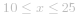

### 📺 视频题解  


### 📖 文字题解
#### 方法一：动态规划

**思路和算法**

首先我们来通过一个例子理解一下这里「翻译」的过程：我们来尝试翻译「*1402*」。

分成两种情况：

+ 首先我们可以把每一位单独翻译，即 *[1, 4, 0, 2]*，翻译的结果是 `beac`
+ 然后我们考虑组合某些连续的两位：
  + *[14, 0, 2]*，翻译的结果是 `oac`。
  + *[1, 40, 2]*，这种情况是不合法的，因为 *40* 不能翻译成任何字母。
  + *[1, 4, 02]*，这种情况也是不合法的，含有前导零的两位数不在题目规定的翻译规则中，那么 *[14, 02]* 显然也是不合法的。

那么我们可以归纳出翻译的规则，字符串的第 *i* 位置：

+ 可以单独作为一位来翻译
+ 如果第 *i - 1* 位和第 *i* 位组成的数字在 *10* 到 *25* 之间，可以把这两位连起来翻译

到这里，我们发现它和「198. 打家劫舍」非常相似。我们可以用 *f(i)* 表示以第 *i* 位结尾的前缀串翻译的方案数，考虑第 *i* 位单独翻译和与前一位连接起来再翻译对 *f(i)* 的贡献。单独翻译对 *f(i)* 的贡献为 *f(i - 1)*；如果第 *i - 1* 位存在，并且第 *i - 1* 位和第 *i* 位形成的数字 *x* 满足  ，那么就可以把第 *i - 1* 位和第 *i* 位连起来一起翻译，对 *f(i)* 的贡献为 *f(i - 2)*，否则为 0。我们可以列出这样的动态规划转移方程：

![f(i)=f(i-1)+f(i-2)\[i-1\geq0,10\leqx\leq25\] ](./p___f_i__=_f_i_-_1__+_f_i_-_2__i_-_1_geq_0,_10_leq_x_leq_25___.png) 

边界条件是 *f(-1) = 0*，*f(0) = 1*。方程中 *[c]* 的意思是 *c* 为真的时候 *[c] = 1*，否则 *[c] = 0*。

有了这个方程我们不难给出一个时间复杂度为 *O(n)*，空间复杂度为 *O(n)* 的实现。考虑优化空间复杂度：这里的 *f(i)* 只和它的前两项 *f(i - 1)* 和 *f(i - 2)* 相关，我们可以运用「滚动数组」思想把 *f* 数组压缩成三个变量，这样空间复杂度就变成了 *O(1)*。

            

**在我们的题目中已经多次出现过「滚动数组」优化动态规划的方法，这是一种非常常见的空间优化，建议还没有掌握的小伙伴可以参考相关资料学习一波哦～**

**代码**

```cpp [sol1-C++]
class Solution {
public:
    int translateNum(int num) {
        string src = to_string(num);
        int p = 0, q = 0, r = 1;
        for (int i = 0; i < src.size(); ++i) {
            p = q; 
            q = r; 
            r = 0;
            r += q;
            if (i == 0) {
                continue;
            }
            auto pre = src.substr(i - 1, 2);
            if (pre <= "25" && pre >= "10") {
                r += p;
            }
        }
        return r;
    }
};
```

```Java [sol1-Java]
class Solution {
    public int translateNum(int num) {
        String src = String.valueOf(num);
        int p = 0, q = 0, r = 1;
        for (int i = 0; i < src.length(); ++i) {
            p = q; 
            q = r; 
            r = 0;
            r += q;
            if (i == 0) {
                continue;
            }
            String pre = src.substring(i - 1, i + 1);
            if (pre.compareTo("25") <= 0 && pre.compareTo("10") >= 0) {
                r += p;
            }
        }
        return r;
    }
}
```

```golang [sol1-Golang]
func translateNum(num int) int {
    src := strconv.Itoa(num)
    p, q, r := 0, 0, 1
    for i := 0; i < len(src); i++ {
        p, q, r = q, r, 0
        r += q
        if i == 0 {
            continue
        }
        pre := src[i-1:i+1]
        if pre <= "25" && pre >= "10" {
            r += p
        }
    }
    return r
}
```

**复杂度分析**

记  。

+ 时间复杂度：循环的次数是 *n* 的位数，故渐进时间复杂度为  。
+ 空间复杂度：虽然这里用了滚动数组，动态规划部分的空间代价是 *O(1)* 的，但是这里用了一个临时变量把数字转化成了字符串，故渐进空间复杂度也是  。